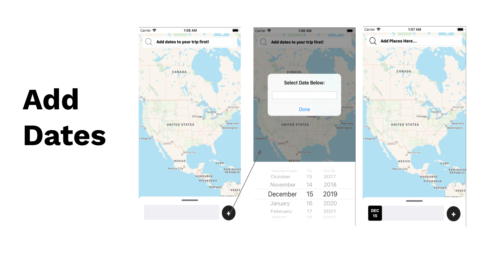
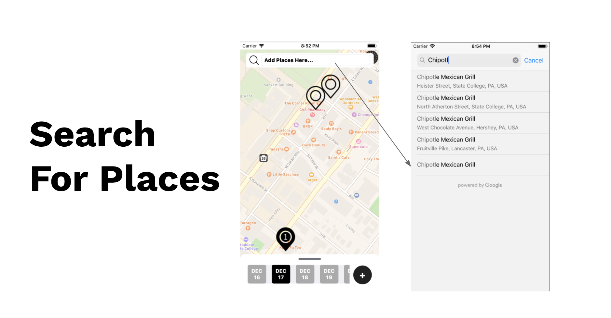
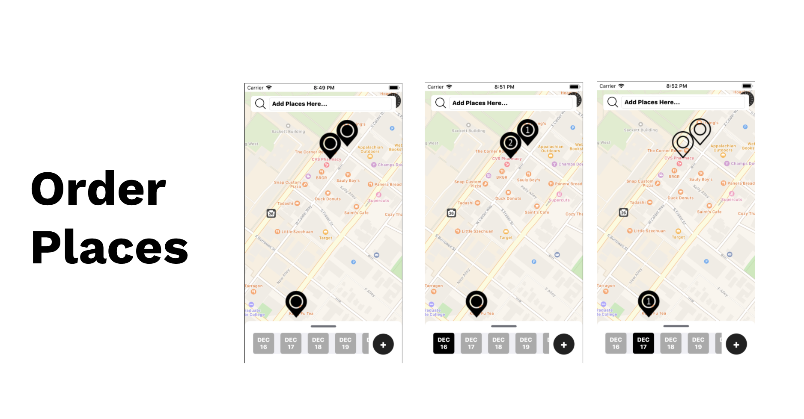
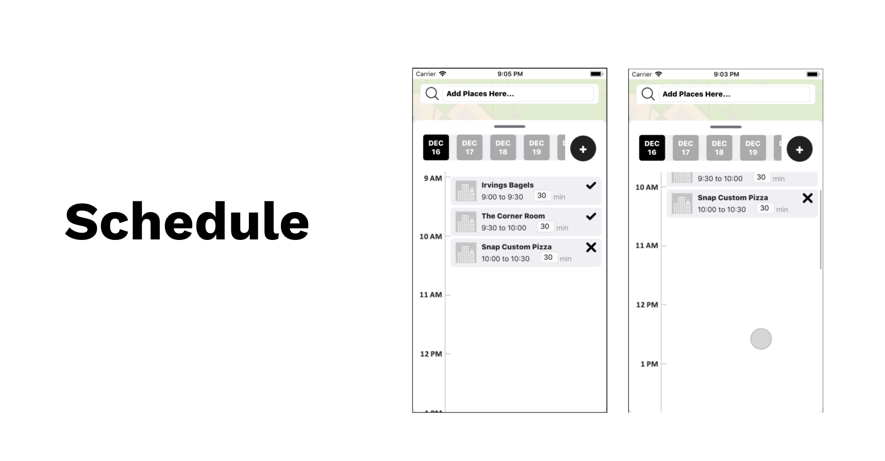

iOS app for custom schedule creation for a trip based on open hours and relative travel time proximity for selected locations of interest on a map.

[See App Proposal](https://docs.google.com/document/d/1-duLHZSM-hR512cFQB5Q3upN9UJ6mXVG0yW6BjSpdo0/edit?usp=sharing)

## Getting Started

*TODO: Add Instructions for GoogleMaps and GooglePlaces Pods use and set up*

*TODO: Port application to Android*

## Implemented Features

